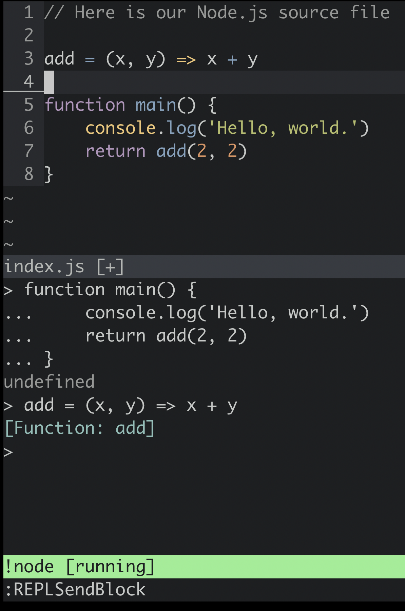
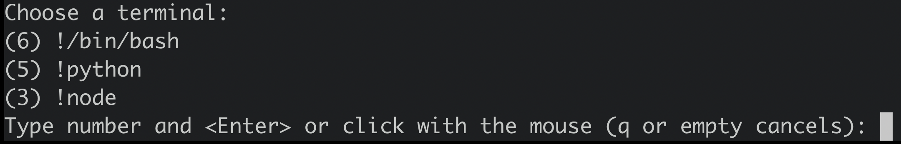

# vim-repl

A bare-bones utility for REPL-based development.

Press `<cr>` (<kbd>Enter</kbd>) over a paragraph of text to send it to a terminal (`:h :term`) of choice.

## Mappings

| Mode		| Mapping	| Description									|
| ----		| -------	| -----------									|
| normal	| `<cr>`	| Send current paragraph to terminal.			|
| visual	| `<cr>`	| Send current visual selection to terminal.	|

## Commands

- `REPLSendOnEnter`: Enable `<cr>` (<kbd>Enter</kbd>) mapping for the current buffer.
- `REPLSendBlock`: Send current paragraph to terminal.
- `REPLSendSelection`: Send current range to terminal.

## Variables

- `b:repl_dst_term`: A reference to the chosen output terminal for the current buffer. Can be `:unlet` to reset the buffer's REPL preference.
